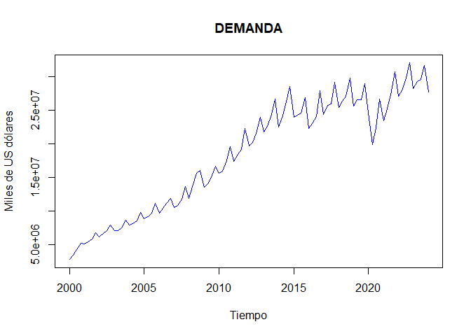

MODULO3: Ciencia de Datos: Modelos Predictivos
================
Hugo Donoso Reinoso
2024-09-1

SECCION A

``` r
basem3<- read.xlsx("E:\\Betametrica\\Modulo III\\Data3.xlsx")
tsbase <- ts(basem3, start = c(2000,1), frequency = 4)
 tsbase
```

    ##         Trimestres Exportaciones Oferta.Monetaria
    ## 2000 Q1          1       4970767         1150.130
    ## 2000 Q2          2       4864094         1435.264
    ## 2000 Q3          3       4919095         1748.174
    ## 2000 Q4          4       4766109         1928.122
    ## 2001 Q1          5       4303228         2163.309
    ## 2001 Q2          6       3950716         2422.064
    ## 2001 Q3          7       3923553         2570.034
    ## 2001 Q4          8       4024629         2837.578
    ## 2002 Q1          9       3907612         3022.106
    ## 2002 Q2         10       4062347         3212.272
    ## 2002 Q3         11       4253337         3338.830
    ## 2002 Q4         12       4320280         3529.628
    ## 2003 Q1         13       4144760         3446.076
    ## 2003 Q2         14       4128985         3501.021
    ## 2003 Q3         15       4546255         3577.373
    ## 2003 Q4         16       4982458         3761.952
    ## 2004 Q1         17       4629438         3881.996
    ## 2004 Q2         18       4830938         3999.140
    ## 2004 Q3         19       5003224         4143.199
    ## 2004 Q4         20       5150763         4371.362
    ## 2005 Q1         21       5128655         4511.708
    ## 2005 Q2         22       5136405         4735.802
    ## 2005 Q3         23       5372385         4863.147
    ## 2005 Q4         24       5625919         5129.310
    ## 2006 Q1         25       5582951         5357.454
    ## 2006 Q2         26       5524021         5547.337
    ## 2006 Q3         27       5702809         5682.478
    ## 2006 Q4         28       5978795         5919.357
    ## 2007 Q1         29       5455854         5952.287
    ## 2007 Q2         30       5405742         6066.792
    ## 2007 Q3         31       5885275         6256.247
    ## 2007 Q4         32       6013790         6631.946
    ## 2008 Q1         33       5974973         6892.224
    ## 2008 Q2         34       5901046         7250.931
    ## 2008 Q3         35       5889518         7717.036
    ## 2008 Q4         36       5988656         8260.420
    ## 2009 Q1         37       5482389         8140.861
    ## 2009 Q2         38       5282940         8123.640
    ## 2009 Q3         39       5631349         8126.965
    ## 2009 Q4         40       5752500         8674.014
    ## 2010 Q1         41       5414310         9076.543
    ## 2010 Q2         42       5489168         9317.116
    ## 2010 Q3         43       5481231         9696.971
    ## 2010 Q4         44       5877920        10303.215
    ## 2011 Q1         45       5753358        10620.051
    ## 2011 Q2         46       5643931        10911.859
    ## 2011 Q3         47       6072055        11282.152
    ## 2011 Q4         48       6237359        11543.183
    ## 2012 Q1         49       6081444        12085.086
    ## 2012 Q2         50       6066167        12419.663
    ## 2012 Q3         51       6272243        12486.600
    ## 2012 Q4         52       6451553        13567.120
    ## 2013 Q1         53       6125503        14035.681
    ## 2013 Q2         54       6158453        14252.446
    ## 2013 Q3         55       6515743        14446.847
    ## 2013 Q4         56       6739198        15346.360
    ## 2014 Q1         57       6410604        15671.213
    ## 2014 Q2         58       6506724        15985.225
    ## 2014 Q3         59       6707648        16899.159
    ## 2014 Q4         60       7141149        17914.454
    ## 2015 Q1         61       6787076        18061.068
    ## 2015 Q2         62       6679702        18203.427
    ## 2015 Q3         63       6377560        18601.123
    ## 2015 Q4         64       5635629        18653.342
    ## 2016 Q1         65       5689639        19208.678
    ## 2016 Q2         66       5537294        19878.346
    ## 2016 Q3         67       6278322        20559.770
    ## 2016 Q4         68       6705580        21526.638
    ## 2017 Q1         69       5871391        22379.550
    ## 2017 Q2         70       6326304        22790.319
    ## 2017 Q3         71       6326527        22861.522
    ## 2017 Q4         72       6320708        23779.161
    ## 2018 Q1         73       6143730        24148.236
    ## 2018 Q2         74       6272609        23972.502
    ## 2018 Q3         75       6238264        24124.527
    ## 2018 Q4         76       6650105        24688.100
    ## 2019 Q1         77       6016762        24846.888
    ## 2019 Q2         78       6763073        24766.408
    ## 2019 Q3         79       6822926        24981.442
    ## 2019 Q4         80       6949241        25589.966
    ## 2020 Q1         81       7024188        26057.144
    ## 2020 Q2         82       4908662        27084.968
    ## 2020 Q3         83       6361362        27234.175
    ## 2020 Q4         84       7220833        27740.602
    ## 2021 Q1         85       6523224        28025.857
    ## 2021 Q2         86       7005436        28263.513
    ## 2021 Q3         87       6974446        28692.186
    ## 2021 Q4         88       7412998        29614.818
    ## 2022 Q1         89       7096371        29773.757
    ## 2022 Q2         90       7289113        29600.106
    ## 2022 Q3         91       7586538        29524.279
    ## 2022 Q4         92       7978800        29766.933
    ## 2023 Q1         93       7772595        30221.873
    ## 2023 Q2         94       7761278        29866.411
    ## 2023 Q3         95       7735934        29664.551
    ## 2023 Q4         96       7378706        30044.618
    ## 2024 Q1         97       7843406        29963.946

LA TASA DE CRECIMIENTO RELATIVA COMPUESTA PARA EXPORTACIONES ES:

``` r
 tasa <- tslm(log10(tsbase[,"Exportaciones"]) ~ trend, data=tsbase)
 summary(tasa)
```

    ## 
    ## Call:
    ## tslm(formula = log10(tsbase[, "Exportaciones"]) ~ trend, data = tsbase)
    ## 
    ## Residuals:
    ##       Min        1Q    Median        3Q       Max 
    ## -0.152297 -0.016871  0.008553  0.026564  0.062265 
    ## 
    ## Coefficients:
    ##              Estimate Std. Error t value Pr(>|t|)    
    ## (Intercept) 6.6503494  0.0076454  869.85   <2e-16 ***
    ## trend       0.0023526  0.0001355   17.37   <2e-16 ***
    ## ---
    ## Signif. codes:  0 '***' 0.001 '**' 0.01 '*' 0.05 '.' 0.1 ' ' 1
    ## 
    ## Residual standard error: 0.03736 on 95 degrees of freedom
    ## Multiple R-squared:  0.7604, Adjusted R-squared:  0.7579 
    ## F-statistic: 301.6 on 1 and 95 DF,  p-value: < 2.2e-16

``` r
 plot(tsbase[,"Exportaciones"], main="Exportaciones", ylab="Millones de USD", xlab="Tiempo")
 abline(tasa, col="blue", lwd=2)
```

<!-- -->

``` r
 (exp(0.0019135)-1)*100
```

    ## [1] 0.1915332

LA TASA DE CRECIMIENTO RELATIVA COMPUESTA PARA OFERTA MONETARIA ESO:

``` r
 plot(tsbase[,"Oferta.Monetaria"], main="Oferta Monetaria", ylab="Millones de USD", xlab="Tiempo")
 abline(tasa, col="red", lwd=2)
```

<!-- -->

``` r
 tasa <- tslm(log10(tsbase[,"Oferta.Monetaria"]) ~ trend, data=tsbase)
 summary(tasa)
```

    ## 
    ## Call:
    ## tslm(formula = log10(tsbase[, "Oferta.Monetaria"]) ~ trend, data = tsbase)
    ## 
    ## Residuals:
    ##      Min       1Q   Median       3Q      Max 
    ## -0.32587 -0.02105  0.02042  0.05540  0.08928 
    ## 
    ## Coefficients:
    ##              Estimate Std. Error t value Pr(>|t|)    
    ## (Intercept) 3.3734380  0.0156090  216.12   <2e-16 ***
    ## trend       0.0131748  0.0002766   47.63   <2e-16 ***
    ## ---
    ## Signif. codes:  0 '***' 0.001 '**' 0.01 '*' 0.05 '.' 0.1 ' ' 1
    ## 
    ## Residual standard error: 0.07627 on 95 degrees of freedom
    ## Multiple R-squared:  0.9598, Adjusted R-squared:  0.9594 
    ## F-statistic:  2269 on 1 and 95 DF,  p-value: < 2.2e-16

``` r
 (exp(0.0048247)-1)*100
```

    ## [1] 0.4836358

SECCION B

REGRESIÓN LINEAL MULTIPLE

``` r
base<- read.xlsx("E:\\Betametrica\\Modulo III\\MRLM\\DATAPIB.xlsx")
 View(base)
 
 attach(base)

 PIB =ts(base[,2], start =c(2000,1),end=c(2024,1), freq=4)
 FBKF =ts(base[,3], start =c(2000,1),end=c(2024,1), freq=4)
 DEMANDA.INTERNA =ts(base[,4], start =c(2000,1),end=c(2024,1), freq=4)
```

\#————————-Graficos de las variables————————

Primer grafico

``` r
 plot(PIB, type = "l", col = "navy", main = "PIB", xlab = "Tiempo", ylab = "Miles de US dólares
")
```

<!-- -->

Segundo grafico

``` r
 plot(FBKF, type = "l", col = "violet", main = "FBKF", xlab = "Tiempo", ylab = "Miles de US dólares")
```

<!-- -->

Tercer grafico

``` r
 plot(DEMANDA.INTERNA, type = "l", col = "blue", main = "DEMANDA", xlab = "Tiempo", ylab = "Miles de US dólares")
```

<!-- -->

``` r
 #------------------------ CONVERTIR UNA SERIE LOG------------------------
 
 log_PIB <- log(PIB)  

 log_FBKF <- log(FBKF)  
 log_DEMANDA.INTERNA <- log(DEMANDA.INTERNA)  

 

 
 #-------------------------Graficos de las variables LOG------------------------
 

 plot(log_PIB)
```

<!-- -->

``` r
 plot(log_FBKF)
```

<!-- -->

``` r
 plot(log_DEMANDA.INTERNA)
```

<!-- -->

``` r
 #------------------------MODELO REGRESION LINEAL MULTIPLE------------------------
 
 
 modelo1 <- lm(log_PIB~ log_FBKF + log_DEMANDA.INTERNA, data = base)
 summary(modelo1)
```

    ## 
    ## Call:
    ## lm(formula = log_PIB ~ log_FBKF + log_DEMANDA.INTERNA, data = base)
    ## 
    ## Residuals:
    ##       Min        1Q    Median        3Q       Max 
    ## -0.082317 -0.017409 -0.002442  0.014115  0.131627 
    ## 
    ## Coefficients:
    ##                     Estimate Std. Error t value Pr(>|t|)    
    ## (Intercept)         0.471253   0.189223   2.490   0.0145 *  
    ## log_FBKF            0.002678   0.031505   0.085   0.9325    
    ## log_DEMANDA.INTERNA 0.970251   0.038435  25.244   <2e-16 ***
    ## ---
    ## Signif. codes:  0 '***' 0.001 '**' 0.01 '*' 0.05 '.' 0.1 ' ' 1
    ## 
    ## Residual standard error: 0.03543 on 94 degrees of freedom
    ## Multiple R-squared:  0.9962, Adjusted R-squared:  0.9962 
    ## F-statistic: 1.248e+04 on 2 and 94 DF,  p-value: < 2.2e-16

``` r
 stargazer(modelo1,type="text")
```

    ## 
    ## ===============================================
    ##                         Dependent variable:    
    ##                     ---------------------------
    ##                               log_PIB          
    ## -----------------------------------------------
    ## log_FBKF                       0.003           
    ##                               (0.032)          
    ##                                                
    ## log_DEMANDA.INTERNA          0.970***          
    ##                               (0.038)          
    ##                                                
    ## Constant                      0.471**          
    ##                               (0.189)          
    ##                                                
    ## -----------------------------------------------
    ## Observations                    97             
    ## R2                             0.996           
    ## Adjusted R2                    0.996           
    ## Residual Std. Error       0.035 (df = 94)      
    ## F Statistic         12,478.130*** (df = 2; 94) 
    ## ===============================================
    ## Note:               *p<0.1; **p<0.05; ***p<0.01

``` r
 #----------------------- ERRORES DENTRO DE LA REGRESION------------------------
 
 #RESIDUALES
 #HOMOCEDASTICO
 
 residuos <- resid(modelo1)
 residuos
```

    ##             1             2             3             4             5 
    ##  0.1316273324  0.0864691858  0.0222880594 -0.0087316665 -0.0120436338 
    ##             6             7             8             9            10 
    ## -0.0475936832 -0.0627309314 -0.0823167989 -0.0709086584 -0.0814294294 
    ##            11            12            13            14            15 
    ## -0.0806772207 -0.0597433796 -0.0242164929 -0.0241968126 -0.0232049855 
    ##            16            17            18            19            20 
    ## -0.0236498729 -0.0177411922 -0.0082650839 -0.0103114651 -0.0136373847 
    ##            21            22            23            24            25 
    ## -0.0083818901  0.0009164425  0.0250668146 -0.0067197000  0.0461747650 
    ##            26            27            28            29            30 
    ##  0.0377891005  0.0140912446  0.0212460983  0.0133057744  0.0444560423 
    ##            31            32            33            34            35 
    ##  0.0383787743  0.0486910051  0.1221506333  0.0744902734  0.0098749558 
    ##            36            37            38            39            40 
    ## -0.0237454361 -0.0232471600  0.0011131212 -0.0117713337  0.0041380002 
    ##            41            42            43            44            45 
    ## -0.0175899119 -0.0080956127 -0.0508998193 -0.0178910844  0.0141146661 
    ##            46            47            48            49            50 
    ##  0.0180182212  0.0121727464 -0.0042481519  0.0316503139  0.0281868180 
    ##            51            52            53            54            55 
    ##  0.0076789668  0.0022136566  0.0027289895  0.0048595725  0.0014174761 
    ##            56            57            58            59            60 
    ##  0.0128451190  0.0514995866  0.0278211192 -0.0121242194 -0.0297468068 
    ##            61            62            63            64            65 
    ## -0.0398521434 -0.0186778483 -0.0320841144 -0.0262992591 -0.0150957767 
    ##            66            67            68            69            70 
    ##  0.0167197556 -0.0038392440 -0.0024418496  0.0073959396 -0.0077307078 
    ##            71            72            73            74            75 
    ## -0.0259913559 -0.0161864308 -0.0005791778 -0.0056559080 -0.0156960793 
    ##            76            77            78            79            80 
    ## -0.0272424373 -0.0159497820 -0.0069482273 -0.0019300393  0.0082791977 
    ##            81            82            83            84            85 
    ##  0.0219385228  0.0048608328  0.0288529419  0.0179776297  0.0111341476 
    ##            86            87            88            89            90 
    ##  0.0247711004 -0.0098301414 -0.0038845390  0.0022858123  0.0148646421 
    ##            91            92            93            94            95 
    ## -0.0174093577 -0.0064882745  0.0013976415  0.0075248759  0.0035895416 
    ##            96            97 
    ## -0.0052537519  0.0418588068

``` r
 # Crear el Q-Q plot de los residuos
 # se puede concluir que los datos tiene normalidad
 
 x11()
 plot(residuos, type = "l", main = "residuos", xlab = "C
ndice", ylab = "residuos")
```

<!-- -->

``` r
 bptest(modelo1)
```

    ## 
    ##  studentized Breusch-Pagan test
    ## 
    ## data:  modelo1
    ## BP = 24.768, df = 2, p-value = 4.185e-06

``` r
 #NORMALES
 shapiro.test(modelo1$residuals)
```

    ## 
    ##  Shapiro-Wilk normality test
    ## 
    ## data:  modelo1$residuals
    ## W = 0.92783, p-value = 4.88e-05

``` r
 ad.test(modelo1$residuals)
```

    ## 
    ##  Anderson-Darling normality test
    ## 
    ## data:  modelo1$residuals
    ## A = 1.9224, p-value = 6.136e-05

``` r
 jarque.bera.test(as.vector(modelo1$residuals))
```

    ## 
    ##  Jarque Bera Test
    ## 
    ## data:  as.vector(modelo1$residuals)
    ## X-squared = 42.81, df = 2, p-value = 5.056e-10

``` r
 #NO AUTOCORRELACION
 dwtest(modelo1)
```

    ## 
    ##  Durbin-Watson test
    ## 
    ## data:  modelo1
    ## DW = 0.44451, p-value < 2.2e-16
    ## alternative hypothesis: true autocorrelation is greater than 0

``` r
 bgtest(modelo1)
```

    ## 
    ##  Breusch-Godfrey test for serial correlation of order up to 1
    ## 
    ## data:  modelo1
    ## LM test = 47.919, df = 1, p-value = 4.442e-12

``` r
 #SISTEMICO
 #MULTICOLINEALIDAD
 vif_valores <- vif(modelo1)
 print(vif_valores)
```

    ##            log_FBKF log_DEMANDA.INTERNA 
    ##            38.90277            38.90277

``` r
 #CORRECTA ESPECIFICACION
 resettest(modelo1)
```

    ## 
    ##  RESET test
    ## 
    ## data:  modelo1
    ## RESET = 23.448, df1 = 2, df2 = 92, p-value = 5.894e-09
